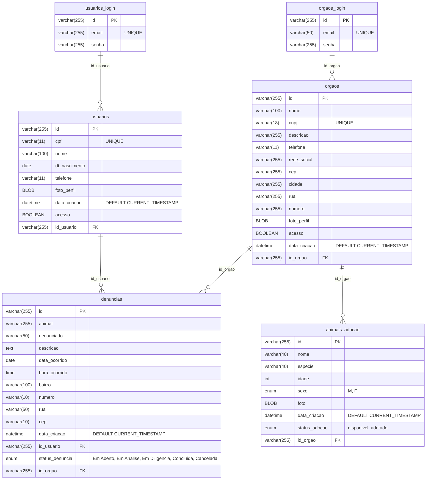

# 🐾 S.O.S Fauna

Bem-vindo à documentação oficial do **S.O.S Fauna**, uma plataforma dedicada a combater maus-tratos contra animais. Neste guia, você encontrará informações sobre como utilizar a plataforma, suas funcionalidades, como contribuir para o projeto e muito mais.

## 📚 Índice

1. [Introdução](#introdução)
2. [Funcionalidades](#funcionalidades)
3. [Como Fazer uma Denúncia](#como-fazer-uma-denúncia)
4. [Privacidade e Segurança](#privacidade-e-segurança)
5. [Para Desenvolvedores](#para-desenvolvedores)
6. [Contribuindo](#contribuindo)

---

## 🐾 Introdução

A **Plataforma S.O.S Fauna** foi criada para oferecer uma solução eficiente, segura e anônima para a denúncia de maus-tratos a animais. Através de um sistema intuitivo, buscamos garantir que os usuários possam agir de maneira rápida e eficaz para proteger os animais e responsabilizar os agressores.

---

## ⚙️ Funcionalidades

- **Acompanhamento de Casos:** Acompanhe o progresso da sua denúncia diretamente na plataforma.
- **Recursos de Apoio:** Fornecemos informações sobre como identificar maus-tratos e como agir para ajudar os animais.
  
---

## 📝 Como Fazer uma Denúncia

1. **Acesse a Plataforma:** Vá até [a plataforma](https://www.google.com/) (link ainda a ser inserido).
2. **Inicie a Conversa com o ChatBot:** Clique no botão **Denunciar Maus Tratos**. Nossa assistente virtual, **Mari**, guiará você em todo o processo de denúncia de forma simples e direta.
3. **Envie a Denúncia:** Após revisar as informações, envie sua denúncia. Você receberá um número de protocolo para futuras consultas.
4. **Crie uma Conta (Opcional):** Se preferir, crie uma conta para acompanhar a evolução do seu caso com seu nome de usuário ou consulte sua denúncia anonimamente utilizando o protocolo gerado.

---

## 🔒 Privacidade e Segurança

A segurança e a privacidade dos nossos usuários são nossa prioridade. As denúncias são armazenadas de forma segura em servidores protegidos. Apenas com o consentimento expresso do usuário, as informações pessoais poderão ser compartilhadas com as autoridades competentes.

---

## 👨‍💻 Para Desenvolvedores

### 🔧 Requisitos do Sistema

- **Node.js** v14 ou superior
- **React JS**
- **Banco de dados SQL**
- **JVM** (Java Virtual Machine)


### 🛠️ Banco de dados - Diagrama Entidade Relacionamento





### 🛠️ Instalação

1. Clone o repositório:
   ```bash
   git clone https://github.com/Helelys/S.O.S-Fauna


## 🌟 Colaboradores

### 💻 Backend

#### Tallys Labanca  
[🔗 Linkedin](https://www.linkedin.com/in/tallys-labanca/) | [🐙 Github](https://github.com/helelys)

#### Arthur Moura  
[🔗 Linkedin](https://www.linkedin.com/in/arthur-moura-20462524b/) | [🐙 Github](https://github.com/ArthurMouraa)

#### Luiz Filipe  
[🔗 Linkedin](https://www.linkedin.com/in/luiz-felipe-35265b1a8/) | [🐙 Github](https://github.com/fluizz00)

#### Maycon Gabriel  
[🔗 Linkedin](https://www.linkedin.com/in/maycon-gabriel-388421214/) | [🐙 Github](https://github.com/May154)

#### Armando Alves  
[🔗 Linkedin](https://www.linkedin.com/in/armando-alves-878356151/) | [🐙 Github](https://github.com/ArmandoMartins1)

---

### 🖥️ Frontend

#### Isabelly Remígio  
[🔗 Linkedin](https://www.linkedin.com/in/isabelly-remigio/) | [🐙 Github](https://github.com/isabelly-remigio)

#### Danielle Ferreira  
[🔗 Linkedin](https://www.linkedin.com/in/danielle-ferreirads/) | [🐙 Github](https://github.com/DanielleFS)

---

🌱 **Agradecemos a todos os colaboradores pelo esforço e dedicação para tornar o projeto S.O.S Fauna uma realidade!**

